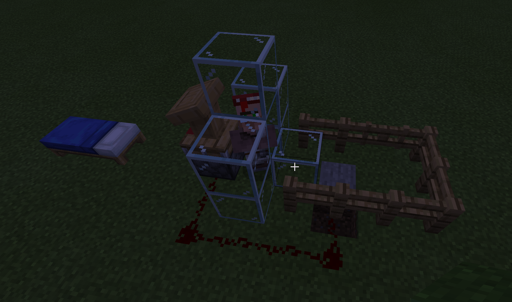

# Minecraft Autoclicker

### Installation
* Requires python 3.9
* If using pytesseract (text extraction) functions install tesseract here: https://tesseract-ocr.github.io/tessdoc/Installation.html

```
pipenv install
```

### Running autoclicker
* Script waits 5 seconds to let you position the player / mouse
```
pipenv run python autoclick.py
```

### Running trades


```
pipenv run python trades.py
```